# Remote Access

This webpage will teach you how to undergo the Remote Access process for CSE15L!

## 1. Installing VScode
The first step is installing VScode onto your device. This is because we will be using the terminal in VScode to execute our commands. If you do not have VScode downloaded on your device yet, you should follow the instructions on the [Visual Studio website](https://code.visualstudio.com/). When VScode is opened it should look like this: 
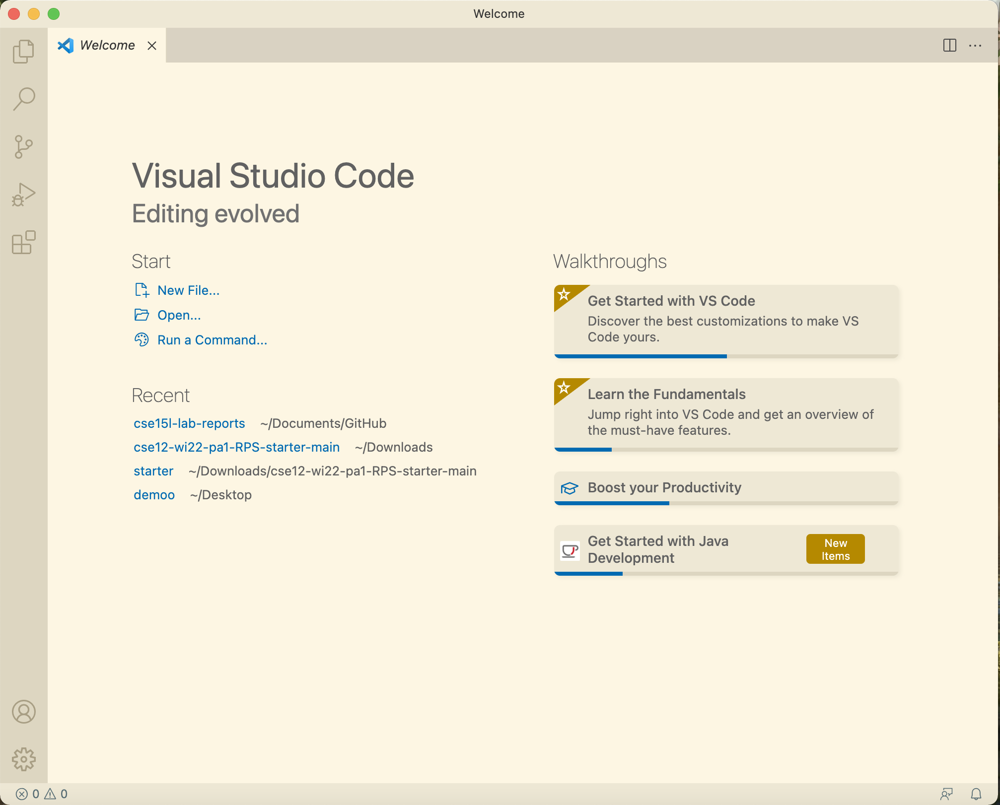

Now VScode has been successfully installed! 

## 2. Remotely Connecting
To remotely connect to the server needed for this class, you must first find out your account name for this class at [this link](https://sdacs.ucsd.edu/~icc/index.php). When you find your account, you must change the password to access it. After changing the password, you can finally connect to the server. 

To connect you must open the terminal at VScode by clicking the New Terminal option in the Terminal menu. Then you must type this command: 

```
ssh <your account>@ieng6.ucsd.edu
```
An example would be: 

```
ssh cs15lwi22ake@ieng6.ucsd.edu
```
You would then be prompted for your password, then logged in. If this is your first time logging in, you would need to grant access by entering "y". 

When logging in the terminal should look like this: 

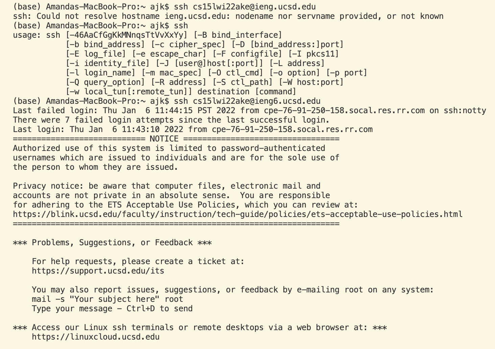
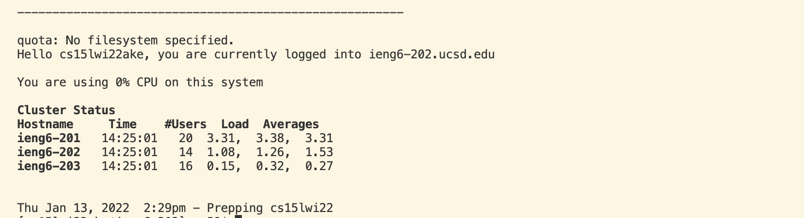

Now you have successfully remotely connected. 

## 3. Trying some commands 

Since we have successfully remotely connected, we can now try to execute some commands! 

* To see a list of your directory contents, try: 
```
ls
```
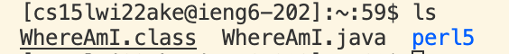

There are commands that can be added to the end of other commands to make it more specific. For example: 
```
ls -a
```
Where it lists out all the files. 
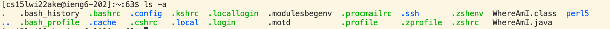
```
ls - lat
```
Where it lists out all the files as long as the time stamps and orders it based by the time created. 
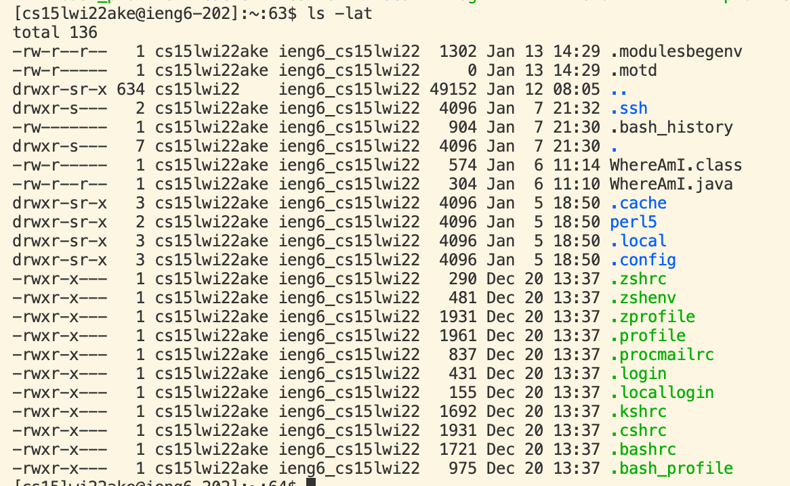

* To make a new directory, try: 
```
mkdir <folder name>
```
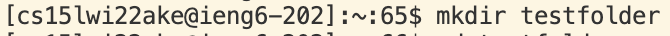
* To change directory, try:
```
cd <directory>
```
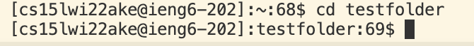
To return back to the home directory do:
```
cd
```
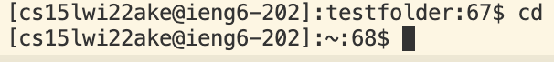
* To delete a directory, try: 
```
rm -r <directory>
```
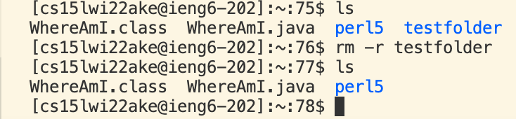

* To exit log out of the server, try: 
```
exit
```
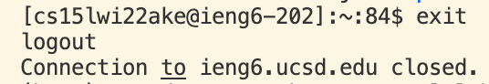
## 4. Moving files with scp 
We can move files from our local device onto the server using scp. First, choose or make a file that you would want to move to the server. Compile and run the file on your local device. For example, let us move a tester file onto the server. 

Let's say I have a file called TestFile.java that consists of this code: 
```
class TestFile{
    public static void main(String[] args){
        System.out.println("This is the test file!");
        }
}
```
First, run this file in your terminal. 
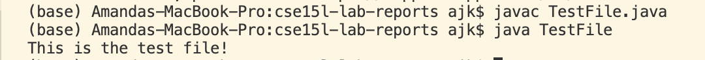

Since we now know that the file complies and runs, we can now move it to our remote server. To do this we need to execute this command: 
```
scp <file name> <your account>:~/
```
In this case: 
```
scp TestFile.java cs15lwi22ake@ieng6.ucsd.edu:~/
```
They will ask for your password and then it will be copied over.

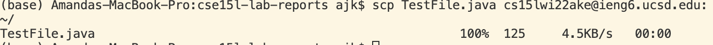

Now, let's check if the file copied over. To do this we will use the `ls` command in the remote server. 

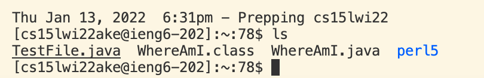 

We can also compile and run the file on the server. 

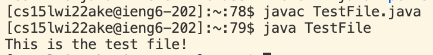

## 5. Setting an SSH Key

Instead of always having to input your password, we can create an ssh key that helps us skip this step. 

You would need to input the following command into your terminal of your local device (client).
```
ssh-keygen
```
Just press the enter key when prompted. 
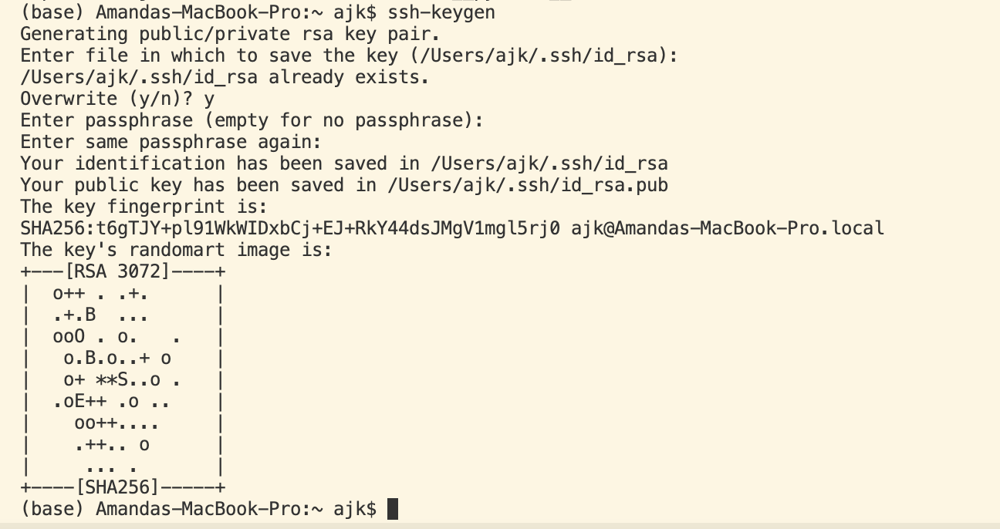

Now you need to move this key onto the remote server. First make a directory in the server by executing `mkdir .ssh`. 

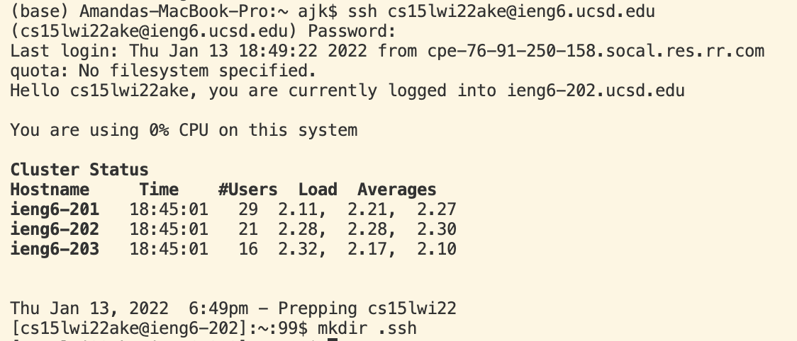

Then exit and execute this command on your client server:
```
scp <location of where key is stored> <your account>:~/.ssh/authorized_keys
```
In this example: 
```
scp /Users/ajk/.ssh/id_rsa.pub cs15lwi22ake@ieng6.ucsd.edu:~/.ssh/authorized_keys
```
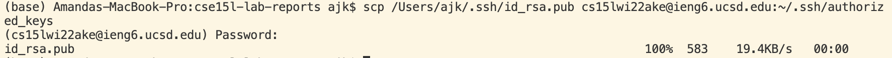

Now when you log into the server, you will not be prompted for your password! 

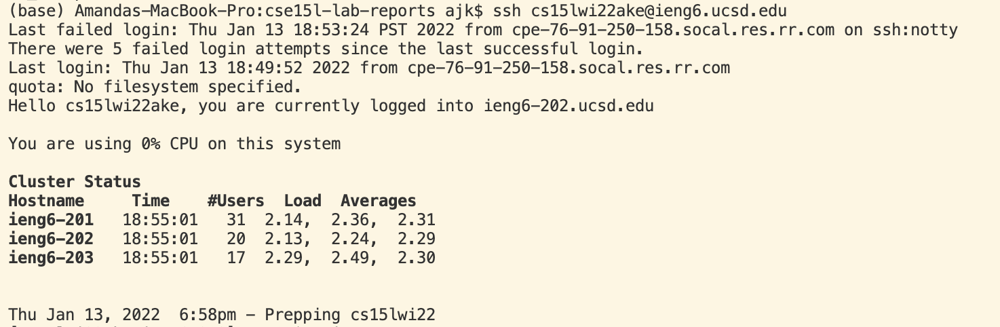

## 6. Optimizing Remote Running 
Instead of logging into the remote server to run commands, you can run commands on your client instead. To do this it will follow this format: 
```
ssh <your account> "command" 
```
What this would do is log into the server, run the command, then log out. 

An example would be 
```
ssh cs15lwi22ake@ieng6.ucsd.edu "ls"
```
This will list out all of the files in the remote server: 
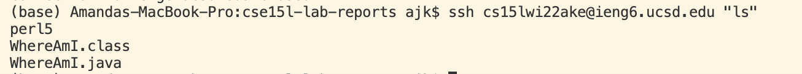

Another trick would be that if you press the up arrow on your keyboard, the command line will be the last command you ran This will make it easier to do commands that are repeated a lot! 