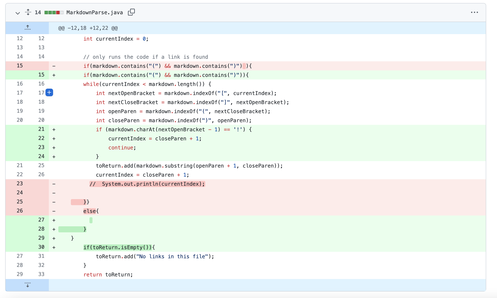

# Fixing Bugs 

This webpage will be for lab report 2! 

## First Code Change 

 

The file that made me make this change was an [empty file](https://github.com/ajkristanto/markdown-parse/blob/main/empty-file.md). 

 

The file has no links to print out so it crashed because the code could not find what it was supposed to be looking for. The code is looking for the content between an opening and closing bracket, however it does not exist in this file hence there is an error. 

The change that I made avoided this problem because before looking for the values between the brackets, it first checks the file if there is a pair of brackets in the first place. If there is, then we know that there will be a link in the file, if it doesn't then we return a statement stating that there are no links in the file. 

## Second Code Change

The file that made me make this change was [test file 6](https://github.com/ajkristanto/markdown-parse/blob/main/test-file6.md) 

There wasn't a failure message per se, however the code identified the image as a link. To avoid this happening, I added an if statement in the code that checks if the first index of the line contains a "!". If it does then it is an image and it will be skipped. I got this code from when the group was working on [Hang Liu's bug](https://github.com/HangLiu01/markdown-parse/blob/1ecefe3d1e32cd5c54f991ec3016bc31ef003f8b/MarkdownParse.java). Instead of an else statement from my code in the first code change, I switched it for another if statement that checks if the list is empty then return a statement indicating so. This is to avoid the problem of if the file has both a link and an image. 

## Third Code Change 
