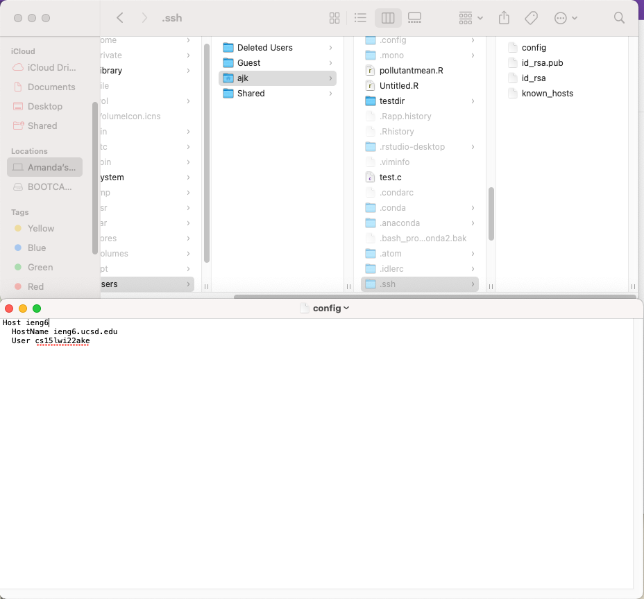
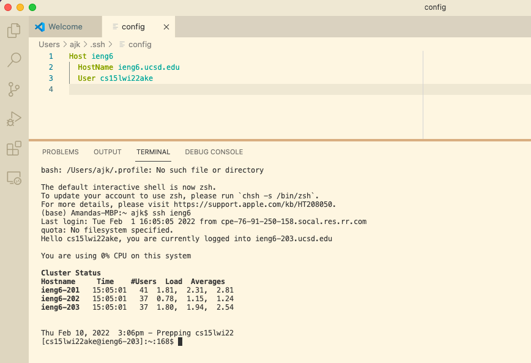
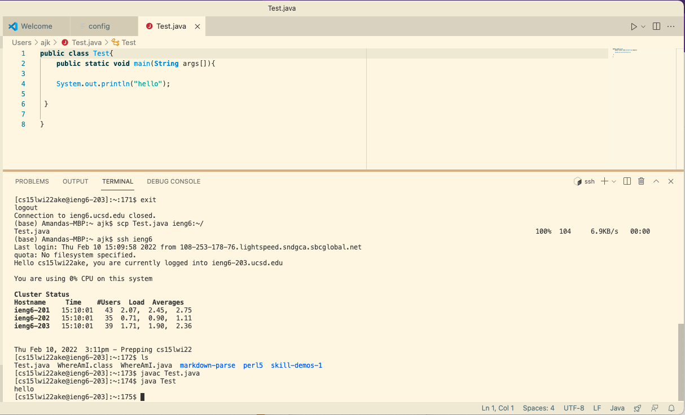

# Streamlining ssh Configuration 

This webpage will show how to streamline ssh configuration so to log in to a remote you would not need to write out the entire command. 

## Config file 

To find the config file, you would need to unhide all of the hidden files. For Mac, to do this you would need to do CMD + Shift + period (.). Then find the .ssh file and then open the config file. Then change the config file to the following: 

```
Host ieng6
    HostName ieng6.ucsd.edu
    User (your username)
```



## Logging in

Now, to log into the remote server all you have to do is type the command `ssh ieng6`. 



Now you can easily log in! 

## Running commands

You can also run commands with this alias. To do so, just replace your username with the alias in all instances. 

For example, we can move files from our local device onto the remote server by executing this command: 

```
scp <file name> <alias>:~/
```

