# Week 8 Lab Report

To decide which is the real links, I used the [CommonMark demo site](https://spec.commonmark.org/dingus/). 

The markdowns I looked at: 

[My markdown](https://github.com/ajkristanto/markdown-parse)
[The markdown I reviewed](https://github.com/IncogOwl/markdown-parse), I reviewed an old version of it on Feb 3rd. 

## Snippet 1

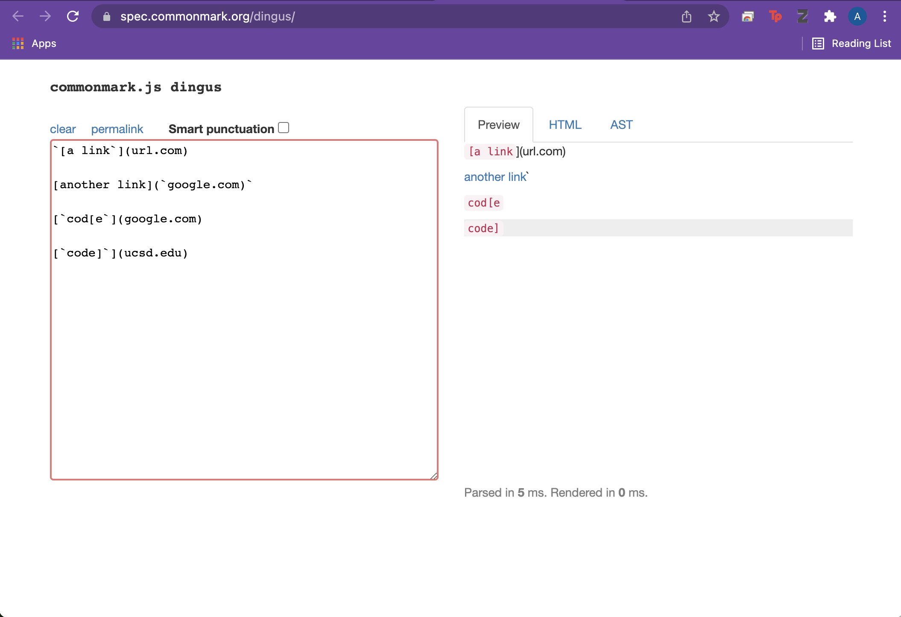
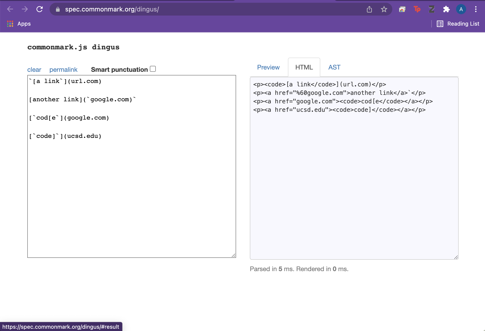

From the website, I decided that the wanted links would be what is referred to as an href in the HTML. Hence the links would be: "%60google.com", "google.com", "ucsd.edu". However, since "%60" is invalid for a link, I just changed it to "google.com" when testing. 

From my own implementation: 

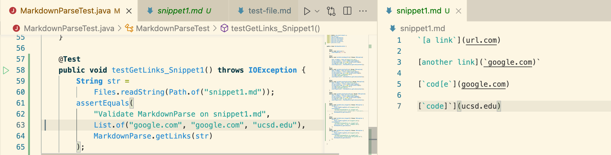

Then this is the result: 

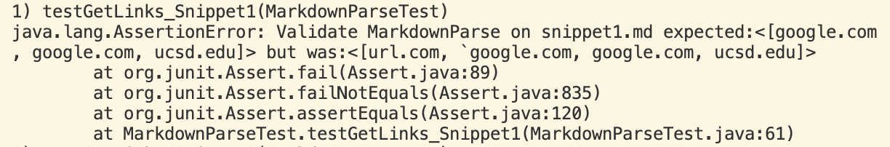


It didn't pass because the `assertEquals` was not equal on Line 61. This is because the expected output and the actual output differs. My code takes url.com as a link and also take the ` in google.com as a link eventhough they are both invalid. 

For the implementation I reviewed: 

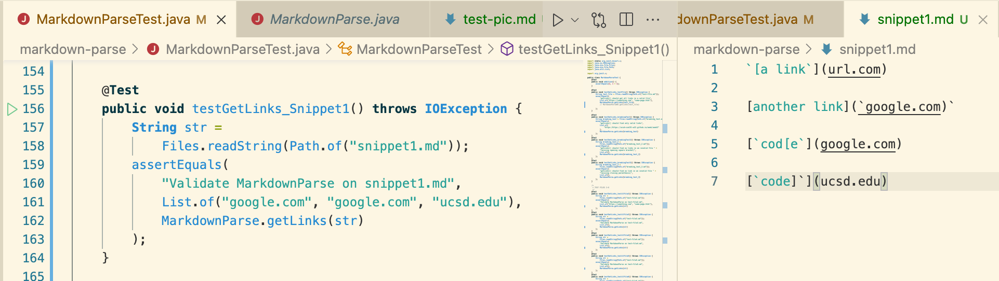

Then this is the result: 

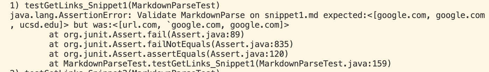


It also didn't pass because the assertEquals was not equal. This code also considers url.com as an output and also has the `google.com as an output. However, it does not have ucsd.edu as an output. 

Hence, to avoid this problem in my own code we must change the code. So we could do this by checking if there is a backtick that opens and closes. So check if theres two backticks. We need to check if it opens before [ and closes before ]. If it exists, skip over it because the backticks will make it a codeblock and not a link. If the backtick is inside the url, ignore it because it is not a valid input for a url. We can do this by making an if statement that checks if there is a backtick before the square brackets close. This will solve the url.com problem. Then we can add another if statement once it goes into pulling the url content and check if there is an invalid component such as the backtick, punctuations and so on then to ignore the component. This should fix the "`google.com" output. 

## Snippet 2

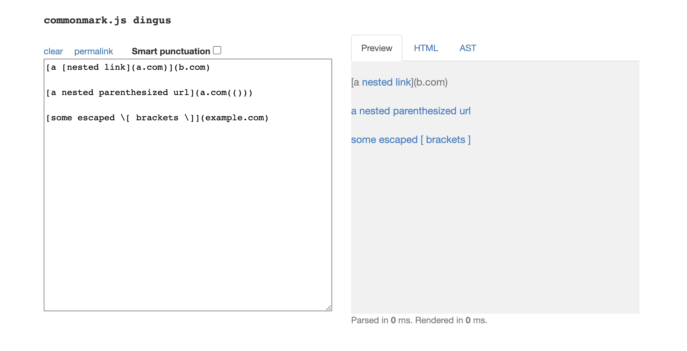
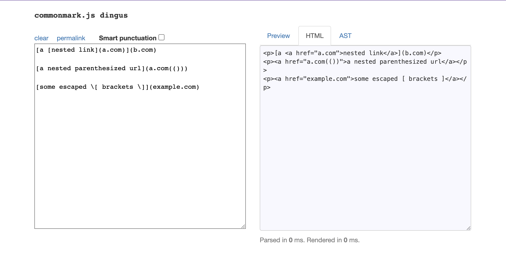

From the website, I decided that the wanted links would be what is referred to as an href in the HTML. Hence the links would be: "a.com", "a.com(())", "example.com". However, since "(())" is invalid for a link, I just changed it to "a.com" when testing.

From my own implementation: 

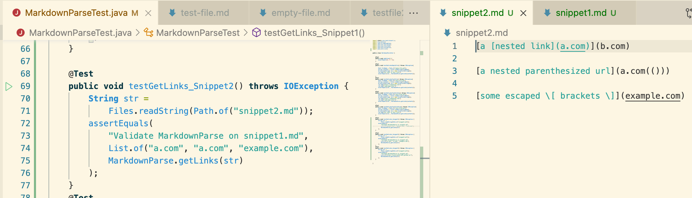

Then this is the result: 

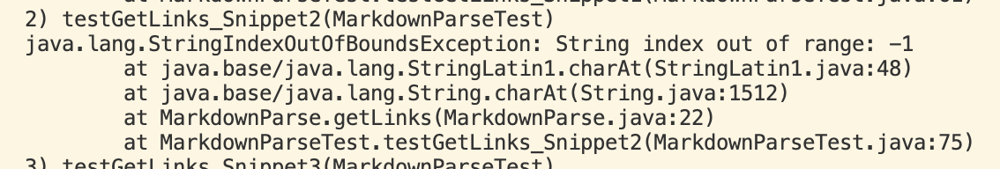


It didn't pass because there was a String index out of range exception.  

For the implementation I reviewed: 

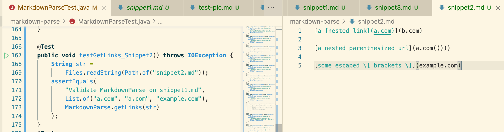

Then this is the result: 

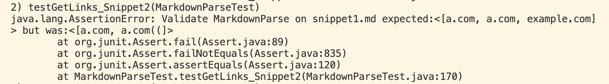


It also didn't pass because the assertEquals was not equal. This code seemed to have stopped running after it read that there was a closed bracket within the link. This is because it didn't consider example.com as a result. 

To fix my code, I believe that there is something crucially wrong with one of my if statements because of the indexOutOfBounds error. Hence to fix the error, I will need to investigate line 22 in my code. However, line 22 is my checker to check if it is an image or not. Hence, to avoid this error I would need to think of a way to ignore an image while also accounting for the error from snippet 2. Since the code I reviewed does not have this problem, I can take some pointers on how to fix it. However when I add an additional conditional to the if statement and modified it to: 
```
if (nextOpenBracket > 0 && markdown.charAt(nextOpenBracket - 1) == '!') {

``` 

It now produces output which is still wrong: 

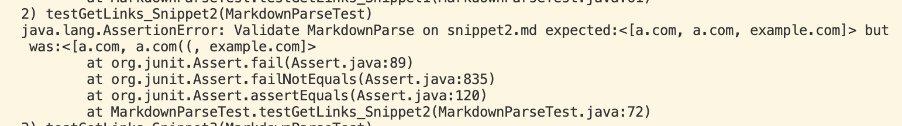

Hence, to fix this I just need a conditional statement that will check for invalid components in the string such as (). Then, this should produce the correct output.


## Snippet 3

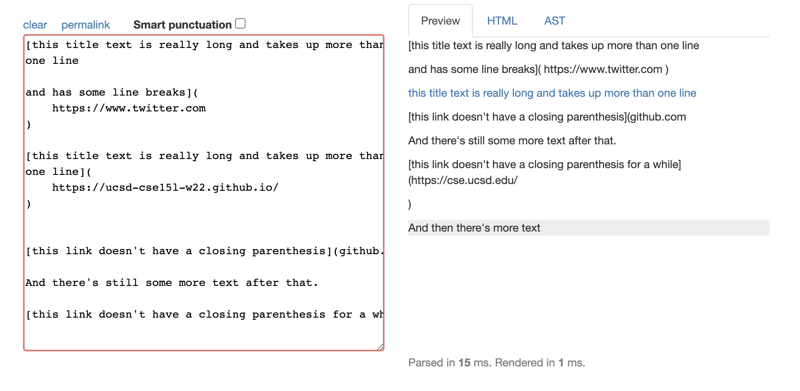
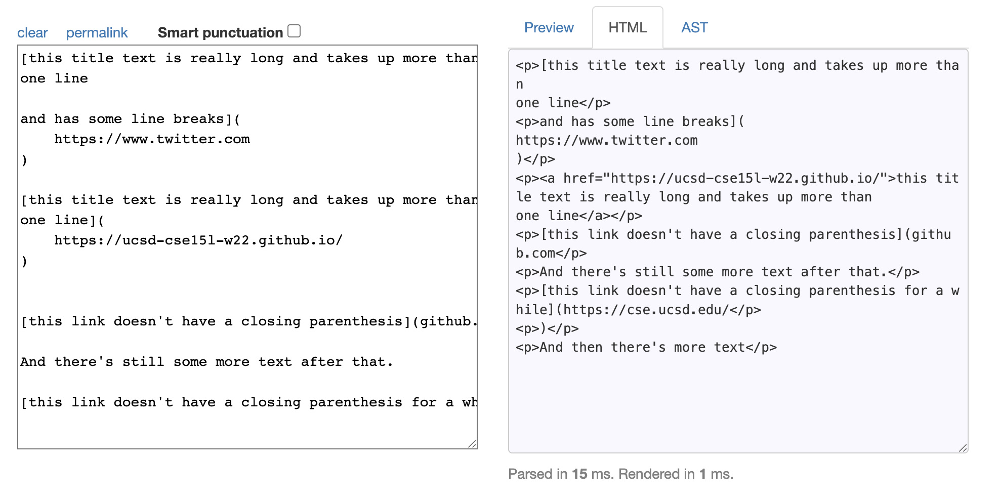

From the website, I decided that the wanted links would be what is referred to as an href in the HTML. Hence the links would be: "https://ucsd-cse15l-w22.github.io/".

From my own implementation: 

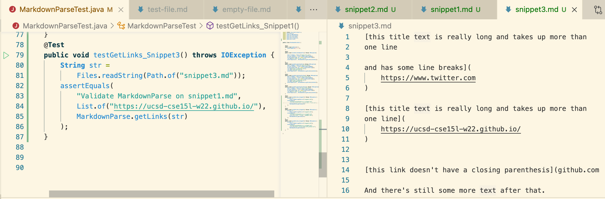

Then this is the result: 

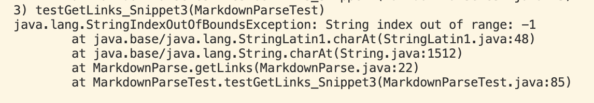

It didn't pass because there was a String index out of range exception.  

For the implementation I reviewed: 

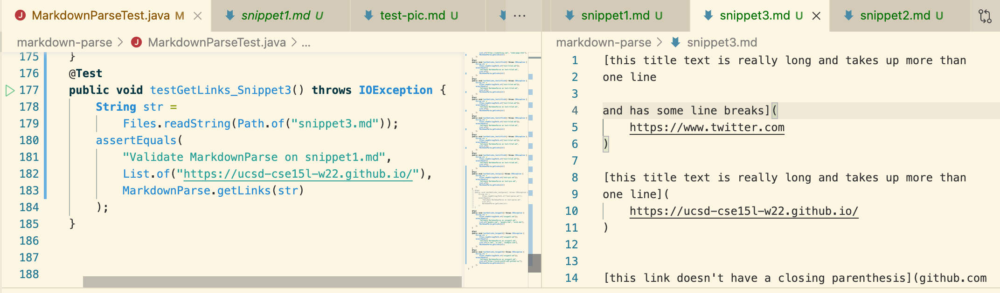

Then this is the result: 

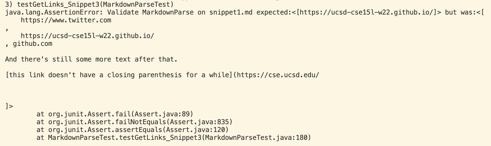

It also didn't pass because the assertEquals was not equal. 

To fix my code, I believe that there is something crucially wrong with one of my if statements because of the indexOutOfBounds error. Hence to fix the error, I will need to investigate line 22 in my code. However, line 22 is my checker to check if it is an image or not. Hence, to avoid this error I would need to think of a way to ignore an image while also accounting for the error from snippet 3. Since the code I reviewed does not have this problem, I can take some pointers on how to fix it. However when I add an additional conditional to the if statement and modified it to from my fix in snippet 2: 
```
if (nextOpenBracket > 0 && markdown.charAt(nextOpenBracket - 1) == '!') {

``` 

It now produces output which is still wrong: 

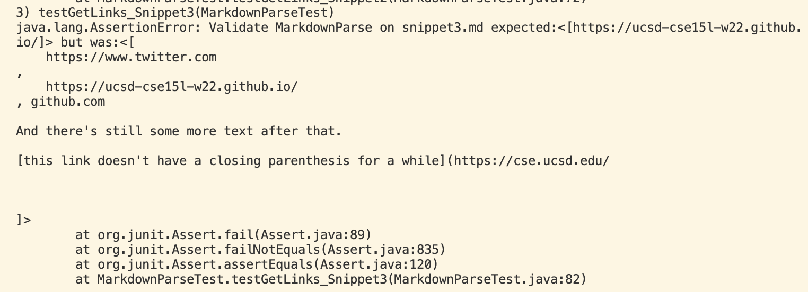

Hence, to fix this I just need a conditional statement that will check for invalid components in the string and the link declaration such as white spaces. If I add this, the code should work. 
   