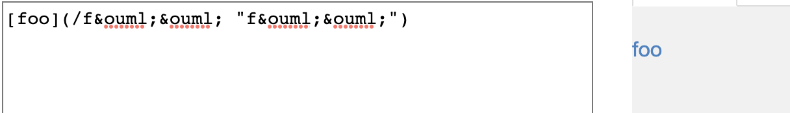
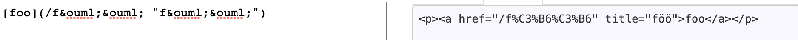
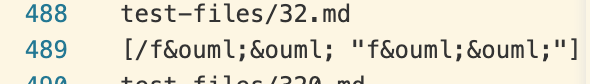
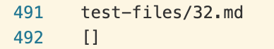
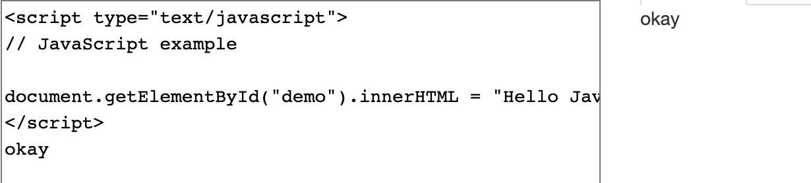
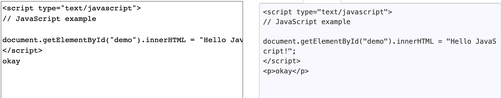
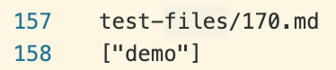
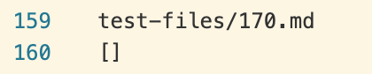

# Lab Report 5 

## The last lab report of CSE15L! 

Hello tutor! Welcome to the last lab report of this class. Have fun! 

I found the differences by making two files on my folder called results.txt and results2.txt and opened both in VS Code on a split screen. Then I just scrolled to compare results and took note of when the results differ. I chose two results that differ in the content as [my markdown parse](https://github.com/ajkristanto/markdown-parse) has a statement that if there are no links, the statement "No links in file" is printed instead of an empty list. 

## Bug 1 
### Test 32

Using the [CommonMark Demo](https://spec.commonmark.org/dingus/) website, I concluded that Test 32 was: 

We can see here that the link is supposed to be [foo](/f%C3%B6%C3%B6) with the link being : "/f%C3%B6%C3%B6". However, this link doesn't make any sense as it is not a valid link. "%C3%B6" is ö in HTML. Hence, I will conclude that the link is invalid, so there will be no links in the file. 

For my implementation: 

For [this](https://github.com/ucsd-cse15l-w22/markdown-parse) implementation: 

This is an interesting case, because mine actually resembles the [CommonMark Demo](https://spec.commonmark.org/dingus/) while [this](https://github.com/ucsd-cse15l-w22/markdown-parse) implementation resembles the logical result. 

However, since I concluded that it should have no links, my implementation would be wrong. To fix this, I should add a conditional statement that checks if the link is a valid link or not. I would do this by checking if there is a valid extension and also if there are any invalid characters in the link such as ";". 

## Bug 2
### Test 170

Using the [CommonMark Demo](https://spec.commonmark.org/dingus/) website, I concluded that Test 170 was: 

We can see here that there are no links in the file as it just prints out "okay" and that there are no href tags in the HTML file. Hence, the output should be that there are no links in the file. 

For my implementation: 

For [this](https://github.com/ucsd-cse15l-w22/markdown-parse) implementation: 

From the results, it is clear that mine is wrong and that [this](https://github.com/ucsd-cse15l-w22/markdown-parse) is correct. It has the right output of no links in the file. 

My implementation counts "demo" as a link. I am honestly unsure why. My implementation seems to count any value within closed brackets as a link. Hence, to change this I would first check if there is a square bracket that indicates the start of a link. Or I could also add an implementation that if there is no period in the text, then its not a valid link because that means theres no valid extension. 